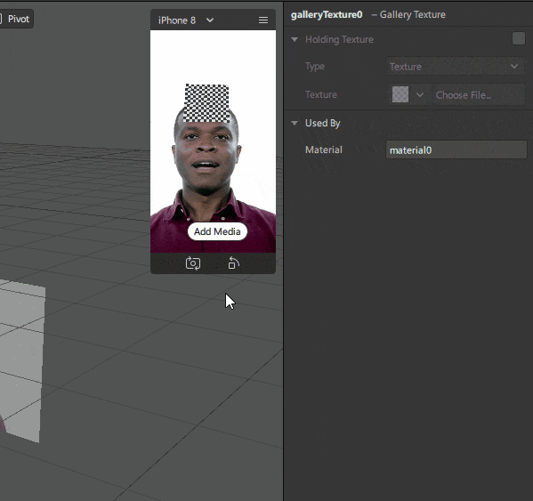

# Overview

On ILO (International Labor Organization) [report](https://www.ilo.org/wcmsp5/groups/public/---dgreports/---dcomm/documents/briefingnote/wcms_755910.pdf), the estimated total working hours loss was 495 million full-time equivalent jobs (FTE) because of COVID-19 pandemic.

In Indonesia, many people have lost their source of income because of this pandemic. They are trying to find new opportunities by opening small businesses. The number of Instagram users in Indonesia is huge, that’s why many small business owners choose this platform to promote their product.

One of Instagram’s outstanding features for promotion is **Instagram Story** with various interesting **Filters**. In this tutorial, we will try to create a filter for small business promotion. Users can change **Filter image** with an image or photo that **they have prepared themselves** for each promotion program.

To try out the sample filter we will create, you can visit this link https://www.instagram.com/ar/950069895499758

We plan this tutorial for a beginner that never code or never uses **Spark AR Studio**. We hope this tutorial can help those who are looking for new opportunities amid this pandemic.

This tutorial will cover **3 fundamental things**:

* **Preparation** and how to install Spark AR Studio
* **Create a simple Filter** in the form of a Promo Card with **Gallery Texture** feature, where user can use their own image or photo on the Filter.
* **Testing** and the steps to **publish** the Filter we have created.

We hope that after following this tutorial, you can create your own filter that works well and published it.

# Table of Content
- [Overview](#overview)
- [Table of Content](#table-of-content)
- [Installing Spark AR Studio](#-installing-spark-ar-studio)
  * [Requirements](#requirements)
    + [Hardware](#hardware)
    + [Account](#account)
  * [Download Installer](#download-installer)
  * [Facebook login](#facebook-login)
- [Create a New Project](#-create-a-new-project)
  * [Opens Blank Project](#opens-blank-project)
  * [Main Display of Spark AR Studio](#main-display-of-spark-ar-studio)
  * [Added Face Tracker](#added-face-tracker)
  * [Adding Plane Objects](#adding-plane-objects)
  * [Rearrange Object Hierarchy](#rearrange-object-hierarchy)
  * [Set Object Position](#set-object-position)
    + [Using View Panel](#using-view-panel)
    + [Using Properties Panel](#using-properties-panel)
  * [Adding Material](#adding-material)
  * [Attaching Material to Objects](#attaching-material-to-objects)
  * [Add Gallery Texture Feature](#add-gallery-texture-feature)
  * [Applying Texture to Material](#applying-texture-to-material)
  * [Setting Up Holding Texture](#setting-up-holding-texture)
  * [Trying Add Media Feature](#trying-add-media-feature)
- [Filter Testing and Publishing](#-filter-testing-and-publishing)
  * [Testing Filter on Device](#testing-filter-on-device)
    + [Testing using Spark AR Player](#testing-using-spark-ar-player)
    + [Testing using an Instagram account](#testing-using-an-instagram-account)
  * [Publish Filters](#publish-filters)
    + [Upload and Export](#upload-and-export)
  * [Approval](#approval)
- [What is next?](#what-is-next)
- [Conclusion](#conclusion)
- [Credit](#credit)

#  Installing Spark AR Studio

**Spark AR Studio** is an augmented reality platform for Mac & Windows that help up create AR effects for mobile cameras. Spark AR studio is easy to use and learn, so there’s nothing to be afraid of! Let’s go!

In this section, we will prepare the things needed for using **Spark AR Studio**.

 

## Requirements
To install **Spark AR Studio**, we need to prepare:

### Hardware
**Spark AR Studio** requires a PC with following minimum specifications:
* Operating System Windows 10 (64 bit) or MacOS 10.14+
* 4GB RAM

You can see more detailed specifications on this page https://sparkar.facebook.com/ar-studio/learn/downloads/#system-requirements

### Account
**Spark AR studios** use **Facebook account** to Log in their apps, and **Instagram account** to upload, test, and publish our filter. If you don’t have one, please create one and we’re ready to go!

## Download Installer
If we have met all the requirements, now we can start installing **Spark AR Studio** by downloading the latest version at https://sparkar.facebook.com/ar-studio/learn/downloads/#spark-ar-studio

We created this tutorial using version v98. After successfully downloading the installer, please install it according to the steps shown.

## Facebook login
The first thing to show when we opened **Spark AR Studio** is a Facebook account login pop-up. Fill it with your account data, and then you can use **Spark AR Studio**.

To log out **Spark AR Studio** from current account, you can do it after opening the project by clicking **File**, then selecting **Log Out**.

This is the end of the first part of total 3 part tutorial. You have successfully prepared **Spark AR Studio** to create **Filters**. We will discuss creating filters in the next section.

 

#  Create a New Project

Now that **Spark AR Studio** has been installed, let's start to make the filter.
In this section, we will create a **Filter project**.

 

Open **Spark AR Studio**

On the **Spark AR Studio** home screen, a variety of templates and tutorials are displayed. (Psstt.. these templates and tutorials are great resources for learning, don't forget to check them out).

## Opens Blank Project

For now, we’ll start by creating a new project from scratch.

Click **Create New > New Project**.

A pop-up will appear for the project types you can create. Then choose **Blank Project**.

## Main Display of Spark AR Studio
**Spark AR Studio** will open a new window. As you can see, we can divide our work area into several key areas.

- A is **Scene** panel. **Scene** panel is useful for arranging order of objects that we will use. Ambient Light and Directional Light available by default. For this project, we will just ignore these two light objects.
- B is **Assets** panel. We will use **Assets** panel to organize files we use in the project, such as images and materials.
- C is **View** panel. The middle section will be your primary work area where you can directly view and edit the position and size of objects in your project. **Spark AR Studio** also provides a **Simulator** window. Use the **Simulator** in **Spark AR Studio** to quickly see how your effect would look on a device, as you're building.
- D is **Properties** panel for adjusting object settings we use.

## Added Face Tracker
Detecting faces and follow its movement is the key part to make this Filter. This feature is very easy to create because **Spark AR Studio** has provided several types of trackers, including **Face Tracker**.

To use **Face Tracker** on **Scene** panel, click **Add Object** button on the lower right side select **Face Tracker** then click **Insert**.

**Face Tracker** object automatically added to the hierarchy in **Scene** panel. You can also rename object by double-clicking or by right-clicking, then select **Rename**.

## Adding Plane Objects
After **Face Tracker**, we need an object that will be the place to display our filter image. We will add a **Plane** object.

To add a **Plane**, we click **Add Object** button on **Scene** panel, select **Plane**, then click **Insert**.

**Plane** object added to **Scene** panel and it also visible on **View** panel. However, **Plane** object is still in place not following user’s head movement.  Don’t worry, we will **fix it in the next step**.

## Rearrange Object Hierarchy
In the object hierarchy, an object placed inside another object will also follow the parent object movement. To make **Plane** object move with the face’s movement, we need to rearrange object hierarchy in **Scene** panel. We need to move **Plane** into **Face Tracker** to move along with facial movements.

On **Scene** panel drag and drop **Plane** object into **Face Tracker** object.

And the result is **Plane** object moves according to the facial movements.

## Set Object Position
If you notice that the position of **Plane** object covers the face, we need to re-adjust position according to what we want. You can directly move object through **View** panel or by using input on **Properties** panel on the right side of screen.

### Using View Panel
You can move objects via **View** by drag the existing arrow line. To make it easier to move object, we can **pause** the **Simulator** by pressing pause button on the left side of screen.

And to move it, just click object on **Scene** panel then on **View** panel drag object’s arrow line to the desired position.

### Using Properties Panel
To move object more precisely, we can use **Properties** panel. For example, we click object on **Scene** panel and on **Properties** panel at the right side of screen we can change the Position Y value to 0.1 so that the position of **Plane** object moves to forehead.

Apart from moving objects, these methods can also change object’s size and rotation. You can try it.

Next, we will add **Material** so object can have a color or image.

## Adding Material

If we look at **Plane** object that currently displayed in a checkerboard pattern, it means **Plane** object doesn’t have any data to display on the screen. To give an appearance to **Plane** object, we need an asset called **Material**.

**Material** is an asset that will control how an object will appear on the screen. **Material** can be colors, images, or animation.

To add **Material**, click **Add Asset** button on **Assets** panel then select **Material**.

## Attaching Material to Objects

After **Material** asset exists, the next step will be to attach **Material** to **Plane** object.

Select **Plane** object on **Scene** panel, then on **Properties** panel on the right side of screen pay attention to **Materials** section. Click + button to select **Material** that we have prepared.

After attaching **Material**, **Plane** object turns white, following **Material** settings.

In the next section, we will add a function to take an image from user’s file and attach it to **Material**. This will allow users to use their own **Promo Card** image.

## Add Gallery Texture Feature

**Gallery Texture** is a feature of **Spark AR Studio** which allows us to use files from user’s Gallery as material. When we create this tutorial, **Gallery Texture** is only available for Instagram platform.

To add **Gallery Texture**, on **Assets** panel click **Add Asset** and select **Gallery Texture**.

Usually, a **Warning pop-up** will appear. We need to deactivate Facebook on the platform we are aiming for (because **Gallery Texture** is only available for Instagram platform). Follow the instruction by click **Review Platform** button then uncheck Facebook option, then click **Done** to finish

Next, we repeat adding a **Gallery Texture**.

After we add **Gallery Texture**, **Add Media** button will appear on **Simulator**. Users can use it to select images they have.

## Applying Texture to Material

Currently, **Plane** object color is white, it is the default **Material** settings. For the next step, we will attach a texture from **Gallery Texture** to **Material** so it can display the image selected by user on **Plane** object.

Click **Material** that you want to change on **Assets** panel. In **Properties** panel on the right side of screen, pay attention to **Shader Properties** section, in **Texture** click drop-down button and select **galleryTexture0** which is the default name of our asset **Gallery Texture**.

**Plane** object that was originally white has changed to a checkerboard pattern again. This is because **Gallery Texture** doesn’t have any data to display yet.

In the next step, we will place a default image to display before user selects their own image.

## Setting Up Holding Texture

**Holding Texture** is the default image **Gallery Texture** use before users select an image of their own choice. Let's set it up.

Click **Gallery Texture** on **Assets** panel, on **Properties** panel on the right side of screen, put a check on **Holding Texture**, and click **Choose File**.

Choose image file you want to use or you can download images from this [link](Assets.zip)

As in **Simulator**, **Plane** objects now have a default texture which is image we selected earlier.

## Trying Add Media Feature

Click **Add Media** button and try to change the default image with files we have.

This button will allow user to use their own files in the Filter we created.

Congratulations! we almost finish the filter, the next step we will try it on device directly to make sure there are no problems in using it. We will do this in the next section.

 

#  Filter Testing and Publishing

Testing before publishing a Filter is an important step to make sure the Filter we make goes well according to what we want to.

## Testing Filter on Device

There are two ways to test it on a device:
- By installing **Spark AR Player** on device.
- By using an **Instagram account** on device.

### Testing using Spark AR Player

You can use **Spark AR Player** to mirror effects, like masks and frames, from your computer to your mobile device and test how your creations respond to movement and interaction.

**Spark AR Player** application is available for Android and IOS, you can download it at https://sparkar.facebook.com/ar-studio/learn/downloads/#spark-ar-player-app.

Once installed, connect device to PC using USB cable.

On the bottom left **Spark AR Studio** there are several buttons, click **Test On Device** button.

Wait for device name to appear and then click **Send** button. **Filters** will automatically open on device.

If device name does not appear, try to reconnect device with PC using USB cable.

### Testing using an Instagram account

If you don't have access to **Spark AR Player**, you can also use your **Instagram** for testing.

On the bottom left **Spark AR Studio** there are several buttons, click on **Test On Device** button. In **Send to App** section, click **Send** on **Instagram Camera**.

When sent, check Instagram on your device. A notification will appear that you can **tap to try** the Filter you have created.

## Publish Filters

Before starting the publishing process, let’s prepare an icon and demo video.
* Icon requirements:
   * Files in PNG or JPG format.
   * It has a square, not rounded corners.
   * The color space is sRGB.
   * The dimensions are a minimum of 200 x 200 pixels.
   * It doesn’t include any transparency.
   * It doesn’t use any of Instagram color gradients.
   
   For further explanation about Icon, please check https://sparkar.facebook.com/ar-studio/learn/publishing/icons-and-names-for-spark-ar-effects. There is also an icon template that can fit the existing requirements.
    
* Demo video requirements:
   * Captured live and saved directly from the app’s camera.
   * Unedited (**no Boomerang videos, no text overlays**).
   * Recorded in portrait (vertical) orientation.
   * A maximum of 15 seconds long.
   * A maximum of 32MB in size.
   * Uploaded as a MOV or MP4 file.
   
   For further explanation about Demo Video, please check https://sparkar.facebook.com/ar-studio/learn/publishing/demo-videos-for-instagram-effects.
   
### Upload and Export

After preparing the icon and demo video, the next step is to upload project to **Spark AR Hub** for publication.

On the bottom left **Spark AR Studio**, click on **Upload and Export** button. Then click **Upload** on the pop-up window that appears. Wait for uploading process to complete.

After upload process is complete, you will directed to **Spark AR Hub** page.

Input the required information and files. Things that need attention:
* On **Platform** be sure to **activate Instagram** and **deactivate Facebook**, because **Gallery Texture** feature is **not available on Facebook**.
* In **Categories** choose relevant category with the filter we created, for this project you can choose **Appearance and Selfies**.
* On **Publication date**, you can choose whether to release it as soon as they approve or you can schedule it.

After you fill the forms, click **Submit** button on the upper right side of **Spark AR Hub** page. If you haven’t completed filling out the form, you can click **Save** button and continue another time by accessing https://www.facebook.com/sparkarhub/effects/

After completing submissions, we just have to **wait for the approval**.

## Approval

Before the public can use Filter, Filter will go through a **review** process **in a few days**.

If our **Filter gets rejected**, a notification will appear on **Facebook** and **Spark AR Hub**, please check the reason for rejection and correct all the requirements before re-submit. After you made update, you can re-submit the Filter.

If they approve our Filter, a notification will also appear on **Facebook** and **Spark AR Hub**.

To use the approved Filter, you can get the link on **Spark AR Hub**.

Or you can access it via **Filter Tab** on your **Instagram account**, the tab marked with a face icon.

By getting approval, it means everyone can use our Filter in their **Instagram Story**.

Congratulations! You have completed all the steps to create a Filter using **Spark AR Studio**.

 

# What is next?

All the project source is in [GitHub](src/). Feel free to observe the project and use it for your own projects.

If you are interested in developing Instagram Filter more, you can visit the following link to try another interesting tutorials and get more information.

- https://sparkar.facebook.com/ar-studio/learn/
- https://www.facebook.com/SparkARcreators/

You can also join the **[Spark AR Community](https://www.facebook.com/groups/SparkARcommunity "Spark AR Community")** to discuss and share information on Filter development with **Spark AR Studio**.

# Conclusion

**Spark AR Studio** with all its features helps us easily create Instagram Filter. We can develop many things and hopefully can create new opportunities in this challenging time.

# Credit
Creator :
- Frida Dwi (Tutorial) https://www.instagram.com/ultrmnbstrd/
- Estu Galih (2D Artist) https://www.instagram.com/nekozilla/

This tutorial was inspired by:
- https://sparkar.facebook.com/ar-studio/learn/articles/textures-and-materials/gallery-texture-and-gallery-picker
