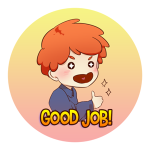
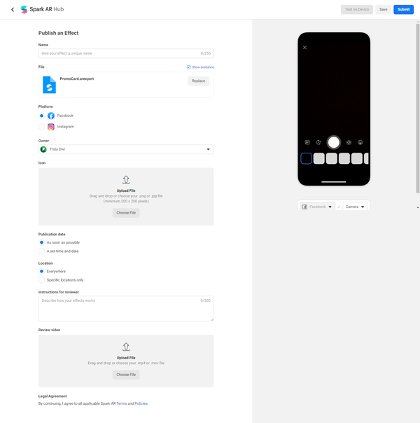

# Overview

On the ILO (International Labor Organization) [report](https://www.ilo.org/wcmsp5/groups/public/---dgreports/---dcomm/documents/briefingnote/wcms_755910.pdf), it is predicted that at least 490 million workers have lost or reduced their working hours due to the Covid-19 pandemic.

In Indonesia, many people have lost their source of income due to this pandemic. But not a few are trying to find new opportunities by opening small businesses. Various ways have been done to promote their business and of course social media has become a favorite platform to use. Instagram as one of the social media with the largest users in Indonesia is the main choice.

One of Instagram's great features for promotion is **Instagram Story** with various interesting **Filters**. In this tutorial we will try to create a Filter which can be used for promotion. This Filter will be in the form of a **Promo Card** which can be easily modified with an image or photo that the user has prepared himself for each promotion program.

We try to design this tutorial to be applied by users who are new to coding or have never even used **Spark AR Studio**, so hopefully it can help those who are looking for new opportunities in the midst of this pandemic.

This tutorial will cover 3 main things:

* Preparation and how to install **Spark AR Studio**
* Create a simple Filter in the form of a **Promo Card** with the **Gallery Texture** feature, where later the user can use their own image or photo on the Filter.
* Testing and the steps to publish Filter that we have created.

We hope that after following this tutorial you will be able to create your own filter that works well and managed to publish it.

#  Installing Spark AR Studio

**Spark AR Studio** is an augmented reality platform for Mac & Windows that allows us to easily create AR effects for mobile cameras. In this section we will prepare the things needed for the use of **Spark AR Studio**.

 

## Requirements
To install **Spark AR Studio** there are several things we need to prepare.

### Hardware
**Spark AR Studio** requires a PC with the following minimum specifications
* Minimum Operating System Windows 10 (64 bit) or MacOS 10.14+
* 4GB minimum RAM

More detailed specifications can be seen on the page https://sparkar.facebook.com/ar-studio/learn/downloads/#system-requirements

### Account
In order to use **Spark AR Studio** and publish the Filter that we are going to create, several accounts are required:
* Facebook account, to log in and use **Spark AR Studio** and organize the projects that we will publish.
* The Instagram account that was connected to the Facebook account, for testing and publishing the Filter that we created.

### Download Installer
If all the requirements have been met, now we can start installing **Spark AR Studio** by downloading the latest version at

https://sparkar.facebook.com/ar-studio/learn/downloads/#spark-ar-studio

When this tutorial was created, the latest version in use is v98. After successfully downloading the installer, please install it according to the steps shown.

### Facebook login
The first thing that is displayed when we open **Spark AR Studio** is a Facebook account login popup, fill it with your account data and then you can use **Spark AR Studio**.

To logout **Spark AR Studio** from the current account, you can do it after opening the project by: clicking **File** then selecting **Logout**.

This is the end of the first part of the total 3 part tutorial. You have successfully prepared **Spark AR Studio** to create **Filters** which will be discussed in the second part of this tutorial.

 

#  Create a New Project

In this section we will start to create a Filter project.

 

Please open **Spark AR Studio** which is already installed, the initial appearance of **Spark AR Studio** is a list of some of the templates provided, and there are several tutorials that you can try yourself later.

## Opens Blank Project

For now we'll start by creating a new project from scratch.

Click **Create New** > **New Project**.

A popup will appear for the project types you can create. Since at this point we will learn from scratch, choose **Blank Project**.

## Main Display of Spark AR Studio
**Spark AR Studio** will open a new window which will become our workarea. If you pay attention, our workarea is divided into several main areas.

- A is the **Scene** panel. **Scene** panel is useful for arranging the order of objects that we will use. Ambient Light and Directional Light have been prepared by default. For this project we will just ignore the two light objects.
- B is the **Assets** panel. We will use the **Assets** panel to organize the files that we use in the project, such as images and materials.
- C is the **View** panel. In the middle section will be the main work area where we can directly view and edit the position and size of objects in our project.
- D is the **Properties** panel. On the right side, there is a **Properties** panel which can be used to adjust the settings of the objects we use.

## Added Face Tracker
Detecting faces is the main thing we need to make this Filter, this feature is very easy for us to make because **Spark AR Studio** has provided several types of trackers including **Face Tracker**.

To use Face Tracker on the **Scene** panel click the **Add Object** button which is on the lower right side then select **Face Tracker** then click **Insert**.

**Face Tracker** object will be automatically added to hierarchy in **Scene** panel.
If desired, you can also rename the object that we created by double-clicking or by right-clicking then select **Rename**.

## Adding Plane Objects
After the Face Tracker, now we need an object that will be the place to display our filter image. We are going to add Plane object

To add a **Plane** we click the **Add Object** button on the **Scene** panel, then select **Plane** then click **Insert**.

The **Plane** object has been added to the **Scene** panel and is also visible in the **View** panel. However, the **Plane** object is still not following the facial movements, we will fix it in the next step.

## Rearrange Object Hierarchy
To make the **Plane** object move with the face's movement, we need to rearrange the object hierarchy in **Scene**. We need to move **Plane** into **Face Tracker** in order to move along with facial movements.

To move it, on the **Scene** panel drag and drop the **Plane** object into the **Face Tracker** object.

And as a result, the **Plane** object moves according to the facial movements.

## Set Object Position
If we notice that the position of the **Plane** object covers the face, we need to adjust the position according to what we want. There are several ways that can be done, you can directly move the object through the **View** panel or by using the input on the **Properties** panel located on the right side of the screen.

### Using the View Panel
Moving objects via **View** can be done by drag the existing arrow lines. To make it easier to move objects, we can **Pause** the camera preview by pressing the pause button on the left side of the screen.

And to move, just click the object on the **Scene** panel and on **View** panel drag the object's arrow line to the desired position.

### Using the Properties Panel
To move objects more precisely we can use the **Properties** panel. For example, we click on the object on the **Scene** panel and on the **Properties** panel on the right side of the screen we change the Position Y value to 0.1 so that the position of the **Plane** object moves to the forehead.

Apart from moving objects, these methods can also be used to change the object's size and rotation. Please try.

Next we will add ** Material ** so that the object can have a color or image.

## Adding Material

If we look at the **Plane** object currently displayed in a checkerboard pattern, it means that the **Plane** object doesn't have any data yet to be displayed on the screen. To give an appearance to the **Plane** object we need an asset called **Material**.

**Material** is an asset that will control how an object will be displayed on the screen. **Material** can display colors, images, or animation.

To add **Material** click the **Add Asset** button on the **Assets** panel then select **Material**.

## Attaching Material to Objects

After the **Material** asset exists, the next step will be to attach the **Material** to the **Plane** object.

Select the **Plane** object on the **Scene** panel, then on the **Properties** panel on the right side of the screen pay attention to the **Materials** section. Click the **+** button to select the **Material** that we have prepared.

After pairing **Material**, **Plane** object turn white, following the **Material** settings.

In the next section we will add a function to take an image from the user's file and attach it to the **Material** that has been created. This will allow users to create their own **Promo Card** image.

## Add Gallery Texture Feature

**Gallery Texture** is a feature of **Spark AR Studio** which allows us to use files from user's Gallery as material. When this tutorial was created, this feature is only available for the Instagram platform.

To add **Gallery Texture**, on the **Assets** panel click **Add Asset** and select **Gallery Texture**.

Usually a **Warning Popup** will appear, meaning we need to deactivate Facebook on the platform we are aiming for. Click the **Review Platform** button then uncheck the Facebook option, then click **Done** to finish.

Next we repeat the process of adding a **Gallery Texture**.

After the **Gallery Texture** is added, the **Add Media** button will appear on the preview camera which can be used by the user to select the images they have.

## Applying Texture to Material

Currently the **Plane** object is white, based on the **Material** settings. For the next step, we will try to attach a texture from **Gallery Texture** to **Material** so that the image selected by the user can be displayed on the **Plane** object.

Click **Material** that you want to change on **Assets** panel. In the **Properties** panel on the right side of the screen, pay attention to the **Shader Properties** section, in **Texture** click the drop down button and select **galleryTexture0** which is the name of our asset **Gallery Texture**.

If we pay attention, the **Plane** object that was originally white has changed to a checkerboard pattern again. This is because **Gallery Texture** doesn't have any data to display yet.

In the next step we will install a default image which will be displayed before the user selects their own image.

## Setting Up Holding Texture

Click **Gallery Texture** on the **Assets** panel, on the **Properties** panel on the right side of the screen, put a check on **Holding Texture** and click **Choose File**.

Choose the image file that you will use. You can use images that you downloaded at the beginning of this tutorial.

As seen in the preview, the **Plane** object now has a default texture which is the image we selected earlier.

## Trying Add Media Feature

We can try clicking the **Add Media** button to try to change the default image with the files we have.

This button will allow the user to use their own files in the Filter that we created.

Congratulations! The filter that we made is almost finished, the next step is to try it on the device directly to make sure there are no problems in using it. We will do this in the next section.

 

#  Filter Testing And Publishing

Testing before publishing Filter is one of the most important steps to make sure the Filter that we make goes well according to what we plan.

## Testing Filter on Device

There are two ways to test a device:
- By installing Spark AR Player on the device
- By using an Instagram account on the device

### Testing using Spark AR Player

**Spark AR Player** application available for Android and IOS, you can download it via the available link at https://sparkar.facebook.com/ar-studio/learn/downloads/#spark-ar-player-app.

Once installed, connect the device to the PC using USB.

On the bottom left **Spark AR Studio** there are several buttons, click the **Test On Device** button.

Wait for the device name to appear, if it appears click the **Send** button. **Filters** are automatically executed on the device.

If the device name does not appear, try to reconnect the device with the PC using USB.

### Testing using an Instagram account

On the bottom left **Spark AR Studio** there are several buttons, click on the **Test On Device** button. In the **Send to App** section, click **Send** on **Instagram Camera**.

When it has been sent, check Instagram on your device, a notification will appear that you can tap to try the Filter that you have created.

Actually we can also test using a Facebook account (Facebook Camera), but because we are using the **Gallery Texture** feature which can only be applied to Instagram, the Facebook Camera option is not displayed.

## Publish Filters

Before starting the publishing process, we need to prepare an icon and demo video.
* Some of icon requirements are:
   * Files in PNG or JPG format.
   * It has square, not rounded corners.
   * The color space is sRGB.
   * The dimensions are a minimum of 200 x 200 pixels.
   * It doesn't include any transparency.
   * It doesn't use any of the Instagram color gradients.
   
   To make an icon that meets the requirements, please check the explanation at https://sparkar.facebook.com/ar-studio/learn/publishing/icons-and-names-for-spark-ar-effects. There is provided an icon template that can be used to fit the existing requirements.
    
* Some of demo video requirements are:
   * Captured live and saved directly from the app's camera.
   * Unedited (no Boomerang videos, no text overlays).
   * Recorded in portrait (vertical) orientation.
   * A maximum of 15 seconds long.
   * A maximum of 32MB in size.
   * Uploaded as a MOV or MP4 file.
   
   To make a demo video that meets the requirements, please check the explanation at https://sparkar.facebook.com/ar-studio/learn/publishing/demo-videos-for-instagram-effects.
   
### Upload and Export

After preparing the icon and demo video, the next step is to upload the project to **Spark AR Hub** for publication.

On the bottom left **Spark AR Studio** there are several buttons, click on the **Upload and Export** button. Then click **Upload** on the popup window that appears. Wait for the uploading process to complete.

After the upload process is complete we will be directed to the **Spark AR Hub** page.

Input the required information and files. Some things that need to be considered include:
* On the **Platform** only activate **Instagram**, because the **Gallery Texture** feature is not available on Facebook.
* In **Categories**, choose the relevant category with the filter that we created, for this project you can choose **Appearence and Selfies**.
* On **Publication date** you can choose whether it will be released immediately when it gets approval or if you want to schedule it at another time.

After all forms are filled in, click the **Submit** button which is on the upper right side of the **Spark AR Hub** page. If you haven't successfully completed filling out the form, you can click the **Save** button and continue on another occasion by accessing https://www.facebook.com/sparkarhub/effects/

After completing submissions, we just have to wait for the Filter that we make to get approval.

## Approval

Before Filter can be used by the public, Filter will go through a **Review** process in a few days.

If our Filter gets rejected, a notification will appear on **Facebook** and **Spark AR Hub**, please check the reason for rejection and make the necessary corrections. Resubmit after updating the Filter.

If our Filter is approved, a notification will also appear on **Facebook** and **Spark AR Hub**.

To use the Filter that has been approved, we can get the link on **Spark AR Hub**.

Or it can be accessed via **Filter Tab** on your **Instagram** account, the tab marked with a face icon.

By getting approval, it means that the Filter that we have created can be used by the public in their **Instagram Story**.

Congratulations! You have completed all the steps to create a Filter using **Spark AR Studio**.

 

# What is next?
If you are interested in developing Instagram Filter more, you can visit the following link to try another interesting tutorials

- link
- link

You can also join the Creators Group to discuss and share information on Filter development with Spark AR Studio

# Conclusion

Creating Instagram Filters can be easily done by anyone using **Spark AR Studio** with all its features. There are many things that can be developed and hopefully can create new opportunities in this challenging time.
